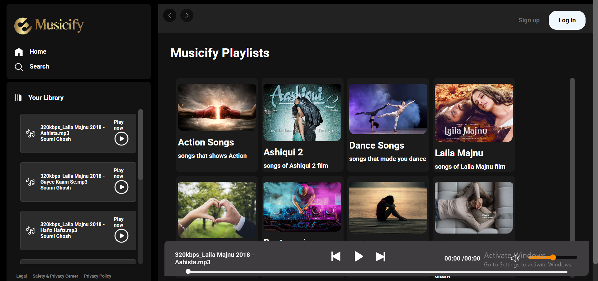

# 🎵 Musicify – Web-Based Music Player

**Musicify** is a simple, offline music player website built using **HTML**, **CSS**, and **JavaScript**. It allows users to play songs, manage albums, and enjoy an ad-free experience — all without storing data on their device.

## 🌟 Features

- 🎧 Play songs directly from local folders
- 📁 Supports multiple albums
- 🚫 No ads, no internet required (offline support)
- 💡 Dynamic content loading via local JSON + API
- 📱 Responsive design for desktop and mobile
- 🎯 Data stored in browser memory, not on device

## 🛠 Tech Stack

- **HTML**
- **CSS** (including media queries for responsiveness)
- **JavaScript**
- Local `JSON` file and `fetch` API for data loading

## 📸 Preview

 <!-- Replace with your actual screenshot -->

## ⚙️ How It Works

- Music albums are stored in folders
- A local JSON file holds metadata about songs (name, path, etc.)
- JavaScript fetches this data and dynamically updates the UI
- Songs play using the HTML5 `<audio>` tag
